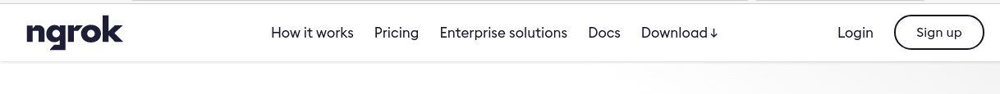
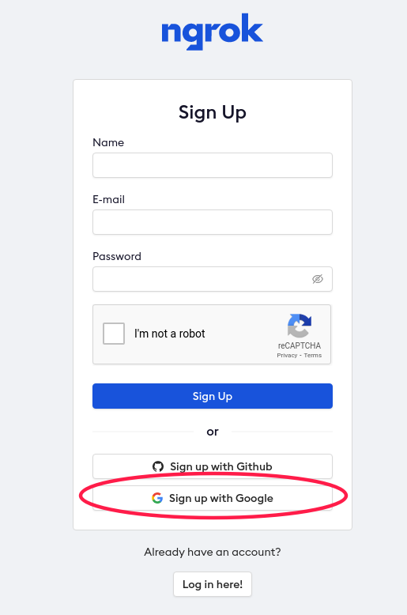

========================================
ngrokで、HTTPSで一時プレビューしてもらう
========================================

:update: 2021-01-22

ngrok概要
=========

ngrok
-----

https://ngrok.com

  Spend more time programming. One command for an instant, secure URL to your localhost server through any NAT or firewall.

ローカルホストをNAT/ファイアーウォール越しにHTTP/HTTPSサーバーとして提供できるようにするサービス

.. revealjs_break::

出来ること

* HTTP/HTTPSアクセスのためのFQDN自動生成
* CLIコマンドによる、ポートフォワーディング
* アクセスのモニタリング
* など

プラン
------

https://ngrok.com/pricing

.. csv-table::
   :header: ,FREE,BASIC,PRO,BUSINESS

   料金(月額),$0,$5,$8.25,$12
   HTTP/HTTPS接続,|:o:|,|:o:|,|:o:|,|:o:|
   公開可能数,1,1,2,2
   FQDNの予約,0,3,5,5

今回のケースでは、FREEのままで十分です

ngrokを使う
===========

大まかな流れ
------------

#. アカウントを作成する
#. クライアントツールをインストールする
#. 認証トークンを取得する
#. ローカルでサーバーを起動する
#. ngrokを起動する
#. ブラウザで見る/見てもらう

アカウントを作成する
--------------------

ngrokサイトの「Sign Up」から進んで、アカウント作成すれば良い

※GitHub or Google のアカウント経由での認証が可能です

.. revealjs_break::

クライアントツールをインストールする
------------------------------------

サインアップ後の画面で、クライアントツールのダウンロードが出来ます。

https://dashboard.ngrok.com/get-started/setup

※各種パッケージマネージャにもあるので、必要に応じてそちらを利用しましょう

認証トークンを取得する
----------------------

CLIインストール後に、サインアップしたアカウントとローカルマシンの連携を行います。

https://dashboard.ngrok.com/get-started/setup

上記ページの、 ``2. Connect your account`` を参考に、認証情報の連携をしてください。

ローカルでサーバーを起動する/ngrokを起動する
--------------------------------------------

別ターミナルで、確認したい環境向けにサーバーを起動します。
その際に、どのポートを待ち受けに起動したかを確認してください

（言語に依存するので、詳細手順は割愛）

その後、CLIを起動して、プレビュー可能な環境を起動します

.. code-block:: bash

   # ローカルで3000番ポートで待ち受けているサーバーをngrokで外部公開したい場合
   ngrok http 3000

.. code-block:: bash

   Session Status                online
   Account                       Kazuya Takei (Plan: Free)
   Update                        update available (version 2.3.35, Ctrl-U to update)
   Version                       2.3.35
   Region                        United States (us)
   Web Interface                 http://127.0.0.1:4040
   Forwarding                    http://d02ee13dd561.ngrok.io -> http://localhost:3000
   Forwarding                    https://d02ee13dd561.ngrok.io -> http://localhost:3000

ブラウザで見る/見てもらう
-------------------------

**'Forwarding' で表示されているURL**

ローカルのサーバーを公開用形式のURLでアクセスできるようになります。

**'Web Interface' で表示されているURL**

ngrokのURL経由でアクセスしたときのリクエストヘッダーなどのモニタリングが出来ます

